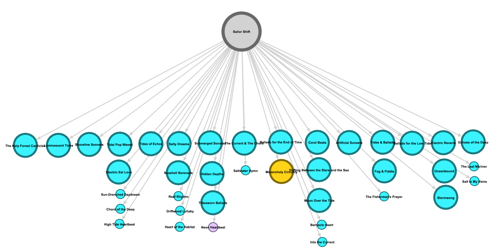
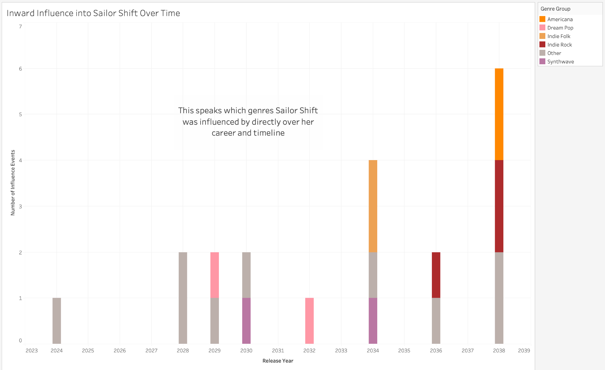
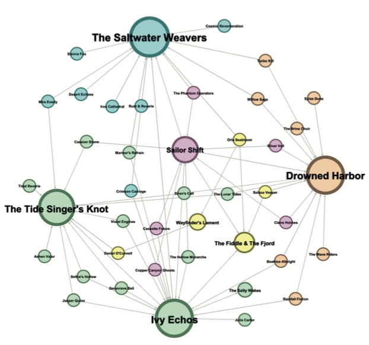
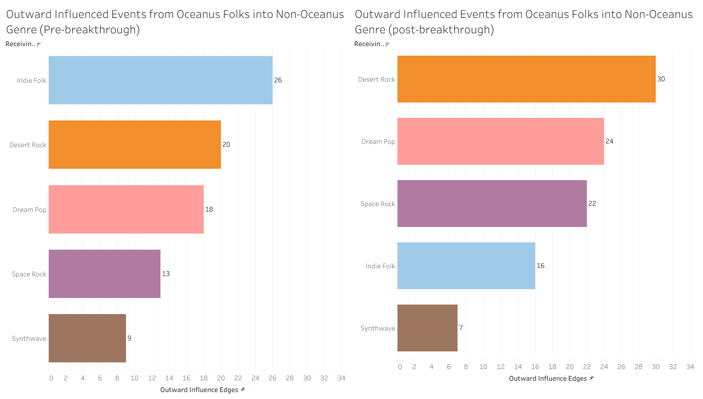
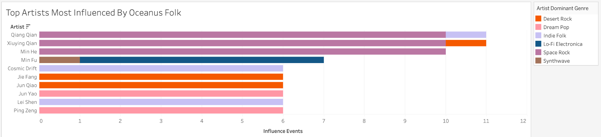
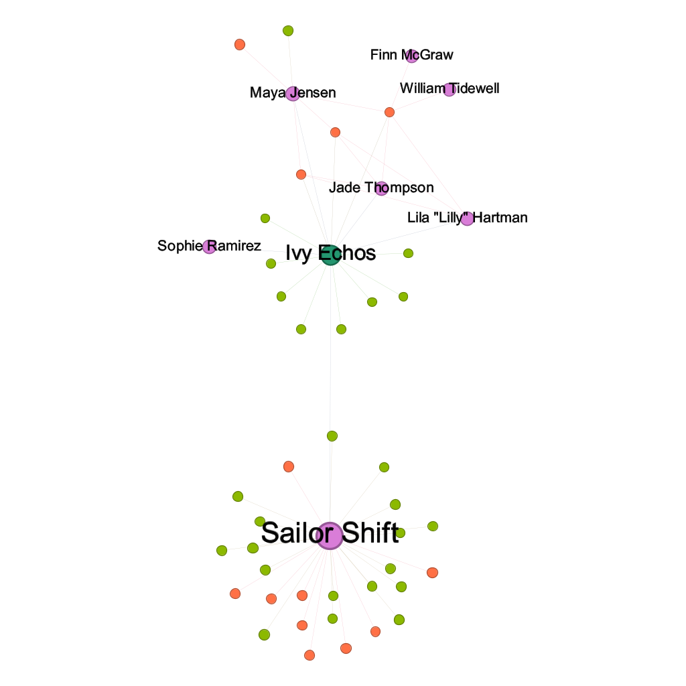
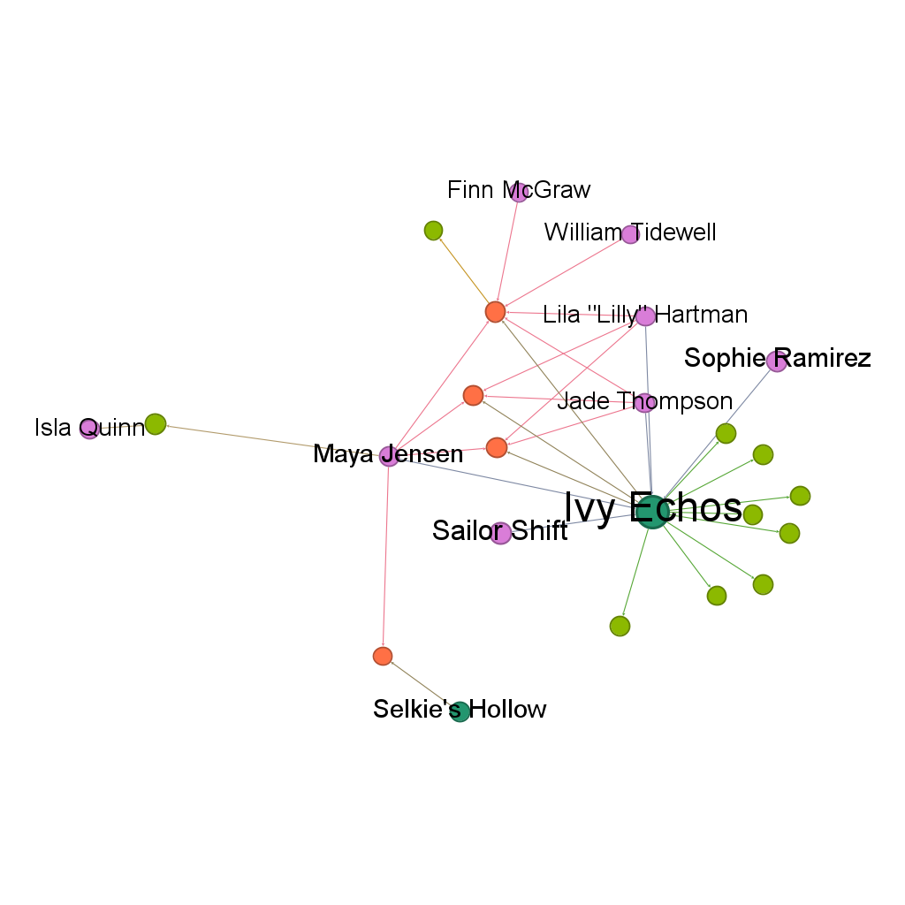
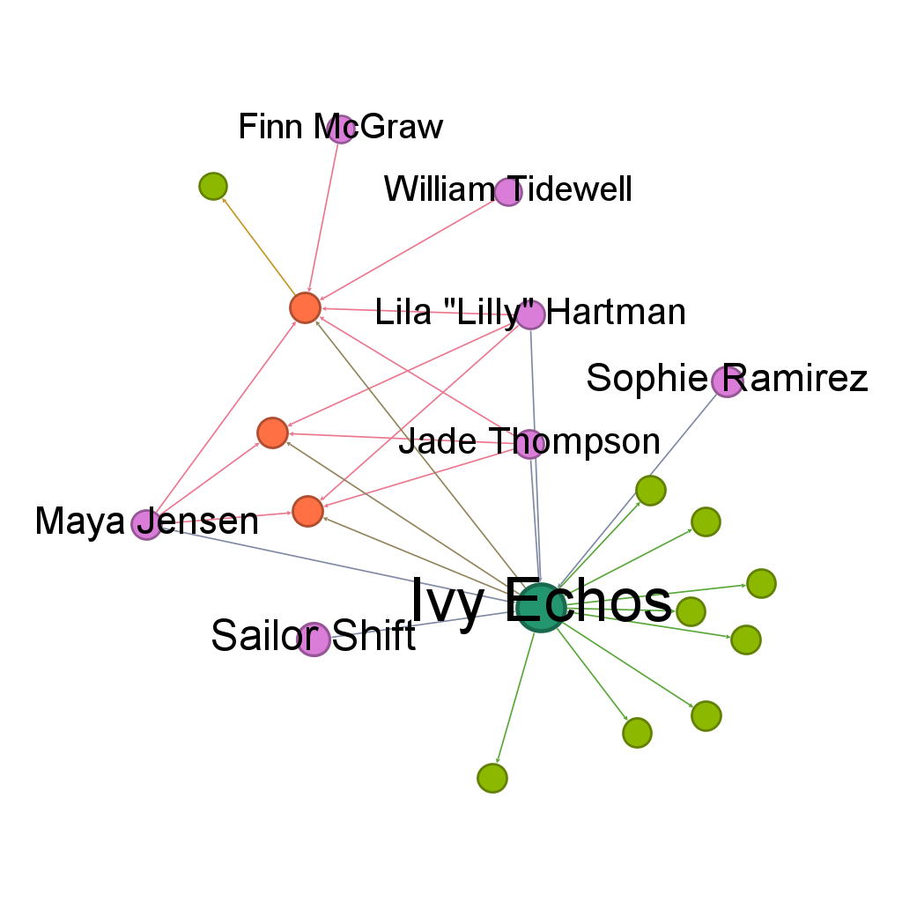

```{=html}
<div class="insights-links-bar">
  <a href="https://docs.google.com/document/d/1KA-uyi1I4SQDHvP02JSvKpccqVfCqnmbfZ6sm0Dlxvo/edit?usp=drive_link" target="_blank" class="insights-link-card">
    <div class="insights-link-icon">
      <svg viewBox="0 0 48 48" xmlns="http://www.w3.org/2000/svg">
        <path d="M7 2v44h34V14L29 2H7z" fill="#4285F4"/>
        <path d="M29 2v12h12L29 2z" fill="#A1C2FA"/>
        <path d="M14 25h20v2H14zm0 5h20v2H14zm0 5h14v2H14z" fill="#fff"/>
      </svg>
    </div>
    <div class="insights-link-copy">
      <span class="insights-link-label">Google Docs</span>
      <span class="insights-link-title">View Full Report</span>
    </div>
  </a>
  <a href="https://github.com/e-tayfw/IS428" target="_blank" class="insights-link-card">
    <div class="insights-link-icon">
      <svg viewBox="0 0 98 96" xmlns="http://www.w3.org/2000/svg">
        <path fill-rule="evenodd" clip-rule="evenodd" d="M48.854 0C21.839 0 0 22 0 49.217c0 21.756 13.993 40.172 33.405 46.69 2.427.49 3.316-1.059 3.316-2.362 0-1.141-.08-5.052-.08-9.127-13.59 2.934-16.42-5.867-16.42-5.867-2.184-5.704-5.42-7.17-5.42-7.17-4.448-3.015.324-3.015.324-3.015 4.934.326 7.523 5.052 7.523 5.052 4.367 7.496 11.404 5.378 14.235 4.074.404-3.178 1.699-5.378 3.074-6.6-10.839-1.141-22.243-5.378-22.243-24.283 0-5.378 1.94-9.778 5.014-13.2-.485-1.222-2.184-6.275.486-13.038 0 0 4.125-1.304 13.426 5.052a46.97 46.97 0 0 1 12.214-1.63c4.125 0 8.33.571 12.213 1.63 9.302-6.356 13.427-5.052 13.427-5.052 2.67 6.763.97 11.816.485 13.038 3.155 3.422 5.015 7.822 5.015 13.2 0 18.905-11.404 23.06-22.324 24.283 1.78 1.548 3.316 4.481 3.316 9.126 0 6.6-.08 11.897-.08 13.526 0 1.304.89 2.853 3.316 2.364 19.412-6.52 33.405-24.935 33.405-46.691C97.707 22 75.788 0 48.854 0z" fill="#24292f"/>
      </svg>
    </div>
    <div class="insights-link-copy">
      <span class="insights-link-label">GitHub</span>
      <span class="insights-link-title">View Source Code</span>
    </div>
  </a>
  <a href="https://public.tableau.com/app/profile/ethan.tay2301/viz/IS428ProjectGroup1TableauVisualisations/SailorShiftandOceanusFolkImpactontheMusicIndustry?publish=yes" target="_blank" class="insights-link-card">
    <div class="insights-link-icon">
      <svg viewBox="0 0 60 60" xmlns="http://www.w3.org/2000/svg">
        <rect x="27" y="2" width="6" height="18" fill="#E8762D"/>
        <rect x="18" y="8" width="24" height="6" fill="#E8762D"/>
        <rect x="27" y="40" width="6" height="18" fill="#E8762D"/>
        <rect x="18" y="46" width="24" height="6" fill="#E8762D"/>
        <rect x="0" y="21" width="6" height="18" fill="#C72037"/>
        <rect x="-9" y="27" width="24" height="6" fill="#C72037"/>
        <rect x="54" y="21" width="6" height="18" fill="#5B879B"/>
        <rect x="45" y="27" width="24" height="6" fill="#5B879B"/>
        <rect x="27" y="21" width="6" height="18" fill="#5C6692"/>
        <rect x="18" y="27" width="24" height="6" fill="#5C6692"/>
      </svg>
    </div>
    <div class="insights-link-copy">
      <span class="insights-link-label">Tableau Public</span>
      <span class="insights-link-title">View Dashboards</span>
    </div>
  </a>
</div>
```

::: {.methodology-intro}
This section contains all analytical insights for each analysis that has been executed. We showcase how each analysis and each insight focuses on fulfilling the project objectives. The analysis forms a narrative from the first analysis to the last.
:::

---

## 4.1) Career Trajectory Analysis

This trajectory analysis contains various insights on Sailor Shift's direct network, temporarily and structurally.

### 4.1.1) Simplified Ego Network

The sheer density of edges radiating from Sailor Shift communicates the scale of the career without needing any numerical annotation. Approximately 38 release nodes (orange/salmon albums and green songs) surround her, alongside group nodes, a label node, and influence-connected artists. The viewer grasps the size and complexity of a 17-year, 38-release career at a glance. The graph immediately reveals that Sailor Shift occupies the single dominant central position. The large purple node at the centre connects to every other entity in the network --- every album, every song, every group, every label. Order was configured using the Ordered Layout Algorithm to show albums and songs that Sailor Shift has a relationship with by release date from left (earliest) to right (latest).

{.insights-figure}

#### 4.1.1.1) Color Legends for Reference

```{=html}
<div class="data-table-wrapper">
  <table class="methodology-table">
    <thead>
      <tr>
        <th>Colour</th>
        <th>Node Type</th>
        <th>Description & Examples in Sailor Shift's Ego Network</th>
      </tr>
    </thead>
    <tbody>
      <tr>
        <td><span style="display:inline-block;width:20px;height:20px;border-radius:50%;background:#c77dff;vertical-align:middle;"></span></td>
        <td>Person</td>
        <td>Individual artists, musicians, and industry professionals. In Sailor Shift's ego network: Sailor Shift herself (central hub), Cassian Storm, Claire Holmes.</td>
      </tr>
      <tr>
        <td><span style="display:inline-block;width:20px;height:20px;border-radius:50%;background:#b5e48c;vertical-align:middle;"></span></td>
        <td>Song</td>
        <td>Individual standalone song releases. In Sailor Shift's network: 17 songs including Seashell Serenade, Stormsong, Fog & Fiddle etc.</td>
      </tr>
      <tr>
        <td><span style="display:inline-block;width:20px;height:20px;border-radius:50%;background:#00b4d8;vertical-align:middle;"></span></td>
        <td>RecordLabel</td>
        <td>Music labels responsible for producing, recording, or distributing works. In Sailor Shift's network: Oceanic Records.</td>
      </tr>
      <tr>
        <td><span style="display:inline-block;width:20px;height:20px;border-radius:50%;background:#ff6b35;vertical-align:middle;"></span></td>
        <td>Album</td>
        <td>Full-length album releases. In Sailor Shift's network: 21 albums including The Kelp Forest Canticles, Tidal Pop Waves etc.</td>
      </tr>
      <tr>
        <td><span style="display:inline-block;width:20px;height:20px;border-radius:50%;background:#2ec4b6;vertical-align:middle;"></span></td>
        <td>MusicalGroup</td>
        <td>Bands, ensembles, or musical collectives. In Sailor Shift's network: Ivy Echos (her founding group), Cassette Future, The Hollow Monarchs, The Phantom Operators, Silver Veil etc.</td>
      </tr>
    </tbody>
  </table>
</div>
```

```{=html}
<div class="data-table-wrapper">
  <table class="methodology-table">
    <thead>
      <tr>
        <th>Colour</th>
        <th>Edge Type</th>
        <th>Meaning & Significance</th>
      </tr>
    </thead>
    <tbody>
      <tr>
        <td><span style="display:inline-block;width:20px;height:4px;background:#1b3a6b;vertical-align:middle;border-radius:2px;"></span></td>
        <td>PerformerOf</td>
        <td>The source artist performed on the target work.</td>
      </tr>
      <tr>
        <td><span style="display:inline-block;width:20px;height:4px;background:#00bcd4;vertical-align:middle;border-radius:2px;"></span></td>
        <td>ComposerOf</td>
        <td>The source artist composed the music for the target work.</td>
      </tr>
      <tr>
        <td><span style="display:inline-block;width:20px;height:4px;background:#9b59b6;vertical-align:middle;border-radius:2px;"></span></td>
        <td>LyricistOf</td>
        <td>The source artist wrote lyrics for the target work.</td>
      </tr>
      <tr>
        <td><span style="display:inline-block;width:20px;height:4px;background:#27ae60;vertical-align:middle;border-radius:2px;"></span></td>
        <td>RecordedBy</td>
        <td>The target label recorded the source work.</td>
      </tr>
      <tr>
        <td><span style="display:inline-block;width:20px;height:4px;background:#8bc34a;vertical-align:middle;border-radius:2px;"></span></td>
        <td>ProducerOf</td>
        <td>The source label or person produced the target entity.</td>
      </tr>
      <tr>
        <td><span style="display:inline-block;width:20px;height:4px;background:#cddc39;vertical-align:middle;border-radius:2px;"></span></td>
        <td>DistributedBy</td>
        <td>The target label distributed the source work.</td>
      </tr>
      <tr>
        <td><span style="display:inline-block;width:20px;height:4px;background:#e74c3c;vertical-align:middle;border-radius:2px;"></span></td>
        <td>InStyleOf</td>
        <td>The source entity's musical style is based on the target entity.</td>
      </tr>
      <tr>
        <td><span style="display:inline-block;width:20px;height:4px;background:#ff9ff3;vertical-align:middle;border-radius:2px;"></span></td>
        <td>InterpolatesFrom</td>
        <td>The source entity borrowed a musical passage, melody, or musical idea from the target and re-performed it in their own work.</td>
      </tr>
      <tr>
        <td><span style="display:inline-block;width:20px;height:4px;background:#a855f7;vertical-align:middle;border-radius:2px;"></span></td>
        <td>LyricalReferenceTo</td>
        <td>The source entity's lyrics explicitly mention or reference the target.</td>
      </tr>
      <tr>
        <td><span style="display:inline-block;width:20px;height:4px;background:#3b82f6;vertical-align:middle;border-radius:2px;"></span></td>
        <td>MemberOf</td>
        <td>The source entity is a member of a specific group.</td>
      </tr>
    </tbody>
  </table>
</div>
```

#### 4.1.1.2) Source of Inspiration

**Cassian Storm** and **Claire Holmes** appear in the middle layer of the graph among the musical groups and collaborators. Their influence edges point upward toward Sailor Shift. Notably, the works they connect to sit in the centre-to-right portion of the timeline (post-breakthrough releases), confirming that Sailor Shift became a cultural reference point only after her solo career was established --- no artist references or interpolates from her during the 2024--2026 emergence phase.

#### 4.1.1.3) Ivy Echos

Ivy Echos sits in the upper-centre of the graph, positioned directly below Oceanic Records and beneath Sailor Shift. It is the most prominent secondary hub after Sailor Shift, connected through both a MemberOf edge and a DirectlySamples edge. Its central horizontal position reflects its relevance across multiple career phases --- Ivy Echos is not anchored to a single period but connects to works spanning the emergence era through to later releases.

#### 4.1.1.4) Oceanic Records

Oceanic Records occupies the central position of the graph, situated directly between Sailor Shift at the top and the layer of musical groups and collaborators below. This central placement visually reinforces the label's role as a persistent institutional anchor --- edges radiate downward from it to albums across the entire horizontal timeline, confirming that the single-label relationship spans all career phases from 2024 to 2040.

---

### 4.1.2) Temporal Release Timeline

This visualisation presents a chronological timeline of all 38 releases (21 albums, 17 songs) connected to Sailor Shift across 2024--2040 (left to right). Nodes are coloured by genre, sized by notability, and manually arranged left-to-right by release year with albums.

{.insights-figure}

#### 4.1.2.1) Color Legend For Reference

```{=html}
<div class="data-table-wrapper">
  <table class="methodology-table">
    <thead>
      <tr>
        <th>Colour</th>
        <th>Genre</th>
        <th>Count</th>
        <th>Releases</th>
      </tr>
    </thead>
    <tbody>
      <tr>
        <td><span style="display:inline-block;width:20px;height:20px;border-radius:50%;background:#00e5ff;vertical-align:middle;"></span></td>
        <td>Oceanus Folk</td>
        <td>36 releases</td>
        <td>The core genre throughout Sailor Shift's career, present in every year from 2024 to 2040.</td>
      </tr>
      <tr>
        <td><span style="display:inline-block;width:20px;height:20px;border-radius:50%;background:#7b2d8e;vertical-align:middle;"></span></td>
        <td>Synthwave</td>
        <td>1 release</td>
        <td>Neon Heartbeat (2031). The only non-notable album in the entire discography. Appears small AND in a distinct colour &mdash; doubly flagged as an outlier.</td>
      </tr>
      <tr>
        <td><span style="display:inline-block;width:20px;height:20px;border-radius:50%;background:#c9a227;vertical-align:middle;"></span></td>
        <td>Americana</td>
        <td>1 release</td>
        <td>Melancholy Circuitry (2033). Unlike Neon Heartbeat, this release retained notable status, suggesting the Americana crossover was more successful.</td>
      </tr>
      <tr>
        <td><span style="display:inline-block;width:20px;height:20px;border-radius:50%;background:#808080;vertical-align:middle;"></span></td>
        <td>N/A (Sailor Shift)</td>
        <td>1 node</td>
        <td><strong>Sailor Shift</strong> (Person node with no genre attribute). Appears grey, naturally distinguishing the artist anchor from surrounding release nodes.</td>
      </tr>
    </tbody>
  </table>
</div>
```

```{=html}
<div class="data-table-wrapper">
  <table class="methodology-table">
    <thead>
      <tr>
        <th>Position</th>
        <th>Years</th>
        <th>Career Phase</th>
      </tr>
    </thead>
    <tbody>
      <tr>
        <td>Far left</td>
        <td>2024&ndash;2026</td>
        <td>Emergence &mdash; Ivy Echos era, lyricist-only, 1 album/year</td>
      </tr>
      <tr>
        <td>Left of centre</td>
        <td>2028&ndash;2030</td>
        <td>Breakthrough &mdash; first performer credits, first singles, 5 releases/year</td>
      </tr>
      <tr>
        <td>Centre</td>
        <td>2031&ndash;2035</td>
        <td>Consolidation &mdash; peak output, genre experiments, 1&ndash;5 releases/year</td>
      </tr>
      <tr>
        <td>Right</td>
        <td>2036&ndash;2040</td>
        <td>Maturity &mdash; return to Oceanus Folk, all notable, 1&ndash;3 releases/year</td>
      </tr>
    </tbody>
  </table>
</div>
```

#### 4.1.2.2) 4 Distinct Career Phases

The timeline reveals four phases through node density patterns. The far left shows three solitary album nodes (2024, 2025, 2026) --- one release per year, all Oceanus Folk, all connected only through LyricistOf edges. This is the emergence phase where Sailor Shift worked exclusively as a lyricist within the Ivy Echos group structure. The graph then jumps to dense vertical columns at 2028 and 2030, each containing 5 releases (1 album plus 4 songs). This is the breakthrough --- output increased fivefold and standalone songs appear for the first time, indicating a shift to solo performer credits. The centre of the timeline is the most densely packed region, spanning 2031--2035. The 2031 column alone contains 4 albums, the highest single-year album count in the career, and 2034 matches the breakthrough density with 5 releases. This is the consolidation phase --- peak productivity and creative confidence. The right side (2036--2040) shows steady but reduced output of 1--3 releases per year, all Oceanus Folk, all notable. This is the maturity phase --- consistent quality without the need for high-volume output.

```{=html}
<div class="data-table-wrapper">
  <table class="methodology-table">
    <thead>
      <tr>
        <th>Year</th>
        <th>Albums</th>
        <th>Songs</th>
        <th>Total</th>
        <th>Career Phase & Key Events</th>
      </tr>
    </thead>
    <tbody>
      <tr><td>2024</td><td>1</td><td>0</td><td>1</td><td>Emergence &mdash; Ivy Echos era, lyricist-only</td></tr>
      <tr><td>2025</td><td>1</td><td>0</td><td>1</td><td>Emergence</td></tr>
      <tr><td>2026</td><td>1</td><td>0</td><td>1</td><td>Emergence</td></tr>
      <tr><td>2028</td><td>1</td><td>4</td><td>5</td><td>Breakthrough &mdash; first solo performer credits + first singles</td></tr>
      <tr><td>2029</td><td>1</td><td>0</td><td>1</td><td>Breakthrough</td></tr>
      <tr><td>2030</td><td>1</td><td>4</td><td>5</td><td>Breakthrough &mdash; Seashell Serenade (notable single)</td></tr>
      <tr><td>2031</td><td>4</td><td>0</td><td>4</td><td>Consolidation &mdash; PEAK: 4 albums incl. Synthwave experiment</td></tr>
      <tr><td>2032</td><td>1</td><td>1</td><td>2</td><td>Consolidation</td></tr>
      <tr><td>2033</td><td>2</td><td>0</td><td>2</td><td>Consolidation &mdash; Americana experiment</td></tr>
      <tr><td>2034</td><td>2</td><td>3</td><td>5</td><td>Consolidation &mdash; second output peak</td></tr>
      <tr><td>2035</td><td>1</td><td>0</td><td>1</td><td>Consolidation</td></tr>
      <tr><td>2036</td><td>1</td><td>2</td><td>3</td><td>Maturity &mdash; return to core Oceanus Folk</td></tr>
      <tr><td>2037</td><td>1</td><td>0</td><td>1</td><td>Maturity</td></tr>
      <tr><td>2038</td><td>2</td><td>1</td><td>3</td><td>Maturity</td></tr>
      <tr><td>2040</td><td>1</td><td>2</td><td>3</td><td>Maturity &mdash; final releases</td></tr>
    </tbody>
  </table>
</div>
```

#### 4.1.2.3) Genre Experimentation at Peak Confidence

The two colour outliers sit precisely in the densest region of the timeline. The gold node (Melancholy Circuitry, Americana, 2033) is large, indicating it achieved notable status --- the crossover was commercially or critically successful. The purple node (Neon Heartbeat, Synthwave, 2031) is small, indicating it is the only non-notable album in the entire 21-album discography --- the Synthwave experiment did not land. Both experiments occur during the consolidation phase when output was at its peak, not during the tentative emergence or the settled maturity. This timing suggests Sailor Shift used the momentum of her established career to explore stylistic boundaries deliberately, rather than experimenting from a position of uncertainty. The fact that every release from 2034 onward returns to Oceanus Folk confirms these were controlled detours, not permanent genre shifts.

#### 4.1.2.4) Breakthrough Inflection Point (2028)

The most significant structural change on the timeline is the jump from 2026 to 2028. The gap itself (no releases in 2027) is visible as wider horizontal spacing. Before 2028, Sailor Shift released one album per year as a lyricist only. From 2028 onward, she appears as a performer for the first time (Tidal Pop Waves carries both PerformerOf and LyricistOf credits) and releases four standalone songs alongside the album. This is the career's defining inflection point --- the transition from behind-the-scenes group lyricist to front-facing solo performer. Everything that follows (the output burst, the genre experiments, the influence accumulation) builds from this moment.

#### 4.1.2.5) Notability Pattern

The size encoding reveals that 25 of 38 releases are notable (large nodes) and 13 are non-notable (small nodes). The non-notable releases are overwhelmingly songs --- 12 of the 13 small nodes are individual songs. Only one album (Neon Heartbeat) failed to achieve notable status. This pattern tells us that Sailor Shift's album catalogue maintained uniformly high quality throughout the career, while standalone songs served a different function --- potentially as experimental releases, promotional singles, or lower-stakes creative output that didn't carry the same critical expectations as full albums.

### 4.1.3) Summary of Analysis 1

In summary, the two visualisations together establish a comprehensive structural and temporal profile of Sailor Shift's career trajectory. (**They may not completely answer every single project objective, but it is a strong anchor to dive deeper to the other analyses.**) Visualisation 1 reveals the ecosystem --- a solo-centred artist who emerged from Ivy Echos, maintained an exclusive relationship with Oceanic Records, built a 38-release catalogue across albums and singles, and occupies a bidirectional influence position where she both inherited from The Saltwater Weavers and The Fiddle & The Fjord and became a stylistic reference point for seven external artists and groups. Visualisation 2 maps this ecosystem onto a 17-year chronological arc, revealing a classic four-phase trajectory: measured emergence as a group lyricist (2024--2026), explosive breakthrough into solo performance (2028--2030), peak-productivity consolidation with deliberate genre experimentation in Synthwave and Americana (2031--2035), and settled maturity with uniformly notable output (2036--2040). The career's defining inflection point --- the 2028 transition from behind-the-scenes lyricist to front-facing performer --- and the mid-career genre experiments positioned at the peak of creative confidence rather than the margins of uncertainty distinguish Sailor Shift's trajectory as one of deliberate, strategically timed artistic evolution.

---

## 4.2) Sailor Shift's Influence and Lineage Analysis

This influence analysis contains various insights on Sailor Shift's ego network after expanding its ego network further, and focuses on Sailor Shift's lineage all within one network. Furthermore, we view the timeline of Sailor Shift's inward influences to see which genres of music she was influenced by over the course of her career.

{.insights-figure}

{.insights-figure}

Methodology stated in Section 3.3 states that we look at different communities in Sailor Shift's expanded network, compared node sizes based on in-degree to observe influence, and separated edge types by edge colors. Based on the network, we have discovered specific findings. Note that edge color legend for this analysis follows the same colors as the career trajectory visualisation in Section 3.2.1 (Simplified Ego Network).

### 4.2.1) Expansion of Influence Events

Sailor Shift's inspiration (in Figure 3) stands from various genres throughout her career, but the inspiration that Sailor Shift has gained only grew throughout her career, standing to gain the most influence at the maturity of her career. We can imply that at each stage of Sailor Shift's Career as mentioned above in Section 4.1.2.2, she was not only looking to expand and gain popularity in the music industry but also be experimental and expand her knowledge of various music types in all phases of her journey. We can see from 2024-2028 (Emergence), where she sticks to her roots initially, but expanded by gaining inspiration as we move from the breakthrough stage to the maturity stage (2028 - 2038). Only at the end of the consolidation stage (2034) to the maturity stage (2038), she moved from other genres and took a huge leap in focusing on Indie Genres (Indie Folk and Indie Rock), and brought that inspiration to her songs. This insight shows how inspiration can be drawn and artists can expand their music even after the prime of their music journey.

### 4.2.2) Five Distinct Influence Communities

The modularity algorithm (**detected to be modularity = 0.374**, moderate quality score for small networks) detected five communities in the influence subnetwork shown above, where each represented a structurally distinct cluster of influence relationships. Shown below are the colors and their representations for each community contained in a table.

```{=html}
<div class="data-table-wrapper">
  <table class="methodology-table">
    <thead>
      <tr>
        <th>Colour</th>
        <th>% of Nodes</th>
        <th>Hub Node(s)</th>
        <th>What Is Observed</th>
      </tr>
    </thead>
    <tbody>
      <tr>
        <td><span style="display:inline-block;width:20px;height:20px;border-radius:50%;background:#a8d5ba;vertical-align:middle;"></span></td>
        <td>35.71%</td>
        <td>Ivy Echos, The Tide Singer's Knot</td>
        <td>Two large high in-degree nodes at the centre, with directed arrows flowing inward from surrounding smaller nodes (Jasper Quinn, Julia Carter, Genevieve Bell, Selkie's Hollow, Violet Engines, The Salty Wakes). The densest cluster in the graph.</td>
      </tr>
      <tr>
        <td><span style="display:inline-block;width:20px;height:20px;border-radius:50%;background:#5b9bd5;vertical-align:middle;"></span></td>
        <td>19.05%</td>
        <td>The Saltwater Weavers</td>
        <td>Single large hub node (highest in-degree in entire graph) with arrows flowing inward from Desert Echoes, Rust & Reverie, Sienna Fox, Iron Cathedral, Cosmic Reverberation, Crimson Carriage, Mariner's Refrain, Orla Seabloom.</td>
      </tr>
      <tr>
        <td><span style="display:inline-block;width:20px;height:20px;border-radius:50%;background:#f4c7a3;vertical-align:middle;"></span></td>
        <td>19.05%</td>
        <td>Drowned Harbor</td>
        <td>Large hub node with arrows from The Brine Choir, Siren's Call, The Wave Riders, Sylas Dune, The Lunar Tides, Beatrice Albright, Rainfall Fiction. Two nodes (The Brine Choir, Siren's Call) connect via cyan DirectlySamples edges &mdash; the highest-directness influence type.</td>
      </tr>
      <tr>
        <td><span style="display:inline-block;width:20px;height:20px;border-radius:50%;background:#e8a0bf;vertical-align:middle;"></span></td>
        <td>14.29%</td>
        <td>Sailor Shift</td>
        <td>Medium-sized hub node with arrows flowing inward from Cassette Future, The Hollow Monarchs, The Phantom Operators, Silver Veil, Claire Holmes, Cassian Storm, Copper Canyon Ghosts. Outward arrows point toward The Saltwater Weavers, The Fiddle & The Fjord, Drowned Harbor, Ivy Echos.</td>
      </tr>
      <tr>
        <td><span style="display:inline-block;width:20px;height:20px;border-radius:50%;background:#f5e6a3;vertical-align:middle;"></span></td>
        <td>11.9%</td>
        <td>The Fiddle & The Fjord</td>
        <td>Peripheral nodes including Solace Vesper, Willow Sage, and Wayfinder's Lament. Smaller, less densely connected cluster.</td>
      </tr>
    </tbody>
  </table>
</div>
```

**Key observation:** Sailor Shift and Ivy Echos are placed into different communities by the algorithm, despite their direct connection. This indicates they occupy structurally distinct positions in the influence network --- Ivy Echos is grouped with established hub nodes, while Sailor Shift forms a separate cluster with her own set of followers.

### 4.2.3) The Influence Hierarchy -- Sailor Shift Has Not Yet Surpassed Her Sources

The average degree of the network remained at **1.575**, where most nodes have around 1-2 edges connecting inward or outwards. However in this analyses, some nodes were spotted to have a high in-degree.

```{=html}
<div class="data-table-wrapper">
  <table class="methodology-table">
    <thead>
      <tr>
        <th>Node</th>
        <th>In-Degree</th>
        <th>Community</th>
        <th>Relative Size in Graph</th>
      </tr>
    </thead>
    <tbody>
      <tr><td>The Saltwater Weavers</td><td><strong>14</strong></td><td>Light Blue</td><td>Largest node</td></tr>
      <tr><td>Drowned Harbor</td><td><strong>13</strong></td><td>Light Orange</td><td>Second largest</td></tr>
      <tr><td>Ivy Echos</td><td><strong>13</strong></td><td>Light Green</td><td>Tied second largest</td></tr>
      <tr><td>The Tide Singer's Knot</td><td><strong>12</strong></td><td>Light Green</td><td>Fourth largest</td></tr>
      <tr><td>Sailor Shift</td><td><strong>7</strong></td><td>Pink</td><td>Medium &mdash; visibly smaller than the four above</td></tr>
      <tr><td>The Fiddle & The Fjord</td><td><strong>4</strong></td><td>Yellow</td><td>Small-medium</td></tr>
    </tbody>
  </table>
</div>
```

Furthermore, none of Sailor Shift's seven directly influenced artists are themselves referenced by other artists in the dataset. Her **outward influence cascade stops at depth 1**, confirming that while she is a growing influence hub, her cultural impact has not yet propagated beyond her immediate followers --- unlike the established tradition-bearers (The Saltwater Weavers, Drowned Harbor, Ivy Echos) whose influence ripples across multiple generations of artists.

**Key observation:** Sailor Shift's in-degree of 7 places her below the four major hub nodes (12--14 each). She is a growing influence hub but has not yet matched the reach of her own upstream sources.

### 4.2.4) Shared Musical Ancestry -- The Lineage Tree

Sailor Shift and Ivy Echos share two upstream influence sources:

```{=html}
<div class="data-table-wrapper">
  <table class="methodology-table">
    <thead>
      <tr>
        <th>Shared Source</th>
        <th>SS's Connection</th>
        <th>Ivy Echos' Connection</th>
      </tr>
    </thead>
    <tbody>
      <tr><td>The Saltwater Weavers</td><td>InStyleOf</td><td>LyricalReferenceTo</td></tr>
      <tr><td>The Fiddle & The Fjord</td><td>InStyleOf</td><td>InterpolatesFrom</td></tr>
    </tbody>
  </table>
</div>
```

Several of Sailor Shift's followers also draw from these same upstream sources, creating a shared lineage pattern:

```{=html}
<div class="data-table-wrapper">
  <table class="methodology-table">
    <thead>
      <tr>
        <th>Artist</th>
        <th>Connection to SS</th>
        <th>Also Draws From</th>
      </tr>
    </thead>
    <tbody>
      <tr><td>The Phantom Operators</td><td>InterpolatesFrom SS</td><td>InStyleOf The Saltwater Weavers</td></tr>
      <tr><td>Claire Holmes</td><td>InterpolatesFrom SS</td><td>InterpolatesFrom Drowned Harbor</td></tr>
      <tr><td>Crimson Carriage</td><td>LyricalReferenceTo Ivy Echos</td><td>InStyleOf The Saltwater Weavers</td></tr>
      <tr><td>Beatrice Albright</td><td>InStyleOf Ivy Echos</td><td>LyricalReferenceTo Drowned Harbor</td></tr>
      <tr><td>Copper Canyon Ghosts</td><td>DirectlySamples SS</td><td>InStyleOf Ivy Echos</td></tr>
    </tbody>
  </table>
</div>
```

**Key observation:** Artists influenced by Sailor Shift are not drawing exclusively from her --- they are drawing from the same lineage tree she belongs to. This indicates her influence reinforces and channels the existing tradition rather than creating a disconnected branch.

### 4.2.5) Sailor Shift as an Influence Bridge

Sailor Shift is the only node in the subnetwork that connects to all four major upstream hubs:

```{=html}
<div class="data-table-wrapper">
  <table class="methodology-table">
    <thead>
      <tr>
        <th>Hub</th>
        <th>SS's Edge</th>
        <th>In-Degree of Hub</th>
      </tr>
    </thead>
    <tbody>
      <tr><td>The Saltwater Weavers</td><td>InStyleOf</td><td>14 (largest in network)</td></tr>
      <tr><td>The Fiddle & The Fjord</td><td>InStyleOf</td><td>4</td></tr>
      <tr><td>Drowned Harbor</td><td>LyricalReferenceTo</td><td>13</td></tr>
      <tr><td>Ivy Echos</td><td>DirectlySamples</td><td>13</td></tr>
    </tbody>
  </table>
</div>
```

No other node connects to all four. This unique position means Sailor Shift synthesised multiple lineage streams and transmitted the combined result to her 7 downstream followers.

Furthermore, Sailor Shift has the second highest betweenness centrality of 26.0, whereas Ivy Echos lead the betweenness centrality score of 46.0. These two nodes are deemed as the main influence hub and essential nodes in maintaining the connectivity and influence between various musical groups and artists.

### 4.2.6) Ivy Echos as a Parallel Influence Hub

```{=html}
<div class="data-table-wrapper">
  <table class="methodology-table">
    <thead>
      <tr>
        <th>Overlap Artists (reference both SS and Ivy Echos)</th>
        <th>Edge to SS</th>
        <th>Edge to Ivy Echos</th>
      </tr>
    </thead>
    <tbody>
      <tr><td>Cassette Future</td><td>InStyleOf SS</td><td>LyricalReferenceTo Ivy Echos</td></tr>
      <tr><td>The Hollow Monarchs</td><td>InStyleOf SS</td><td>InterpolatesFrom Ivy Echos</td></tr>
      <tr><td>Copper Canyon Ghosts</td><td>DirectlySamples SS</td><td>InStyleOf Ivy Echos</td></tr>
    </tbody>
  </table>
</div>
```

Ivy Echos also attracts 9 followers who do not reference Sailor Shift at all (Violet Engines, Jasper Quinn, Julia Carter, Genevieve Bell, Selkie's Hollow, Mariner's Refrain, Rainfall Fiction, Beatrice Albright, Crimson Carriage). The group continues to exert independent influence beyond its former member's solo career.

### 4.2.7) The Extended Ripple -- Influence Cousins

At depth 2 and 3, approximately 18 additional artists appear who reference Sailor Shift's upstream sources (The Saltwater Weavers, Drowned Harbor, The Tide Singer's Knot, The Fiddle & The Fjord) but do not reference Sailor Shift herself. These include Desert Echoes, Rust & Reverie, Iron Cathedral, Cosmic Reverberation, Sienna Fox (all drawing from The Saltwater Weavers), The Brine Choir, Siren's Call, The Wave Riders, Sylas Dune (drawing from Drowned Harbor), and Tidal Reverie, Daniel O'Connell, Ashen Valor (drawing from The Tide Singer's Knot). These are "influence cousins" --- artists in the same lineage tree who share Sailor Shift's musical ancestry but have not yet connected to her directly. Their presence maps the broader reach of the Oceanus Folk influence ecosystem beyond Sailor Shift's personal impact.

### 4.2.8) Summary of Analysis 2

The influence and lineage analysis reveals that Sailor Shift occupies a structurally unique position within the Oceanus Folk influence ecosystem. She sits at the convergence of four upstream lineage streams (The Saltwater Weavers, The Fiddle & The Fjord, Drowned Harbor, Ivy Echos) and channels them outward to seven directly influenced artists. The Modularity algorithm's placement of Sailor Shift and Ivy Echos into separate communities confirms that she has established an independent influence identity distinct from her group origins. However, her in-degree of 7 compared to the established tradition-bearers' in-degrees of 12--14 indicates she is a growing but not yet dominant influence hub. The shared lineage pattern --- where her followers also draw from her own sources --- shows that her influence reinforces and amplifies the existing Oceanus Folk tradition rather than diverging from it. This positions her as a bridge and synthesis point within the genre's influence network: inheriting from multiple traditions, recombining them, and transmitting the result to a new generation of artists.

---

## 4.3) Sailor Shift's Collaboration and Network Analysis

### 4.3.1) Collaboration Reach of Sailor Shift

In Section 4.2, we covered influence, where we observed how Sailor Shift's work stylistically references, interpolates from, or samples another artist. In these edges, they do not represent any form of direct collaboration, but rather influence and inspiration.

{.insights-figure}

{.insights-figure}

Sailor Shift shared credits with **48 unique artists** and groups across **17 albums**. These are not influence connections --- these are people who physically contributed to the same releases. Within the network we discovered further insights on the direct and indirect reach of collaborators:

#### 4.3.1.1) Two Core Collaboration Teams

The graph reveals two distinct, recurring collaborator clusters, where timeline matches with the timestamps given in insights in Section 4.1.2:

```{=html}
<div class="data-table-wrapper">
  <table class="methodology-table">
    <thead>
      <tr>
        <th>Team</th>
        <th>Members</th>
        <th>Shared Albums</th>
        <th>Career Phases</th>
      </tr>
    </thead>
    <tbody>
      <tr>
        <td>Ivy Echos founding members</td>
        <td>Maya Jensen (4 shared works), Lila "Lilly" Hartman (3), Jade Thompson (3), Sophie Ramirez (4)</td>
        <td>The Kelp Forest Canticles (2024), Luminescent Tides (2025), Shoreline Sonnets (2026)</td>
        <td>Emergence (2024&ndash;2026)</td>
      </tr>
      <tr>
        <td>The Brine Choir</td>
        <td>Arlo Sterling (3), Lyra Blaze (3), Orion Cruz (3), Elara May (3), Cassian Rae (3)</td>
        <td>Drifting Between the Stars and the Sea (2034), Artificial Sunsets (2035), Electric Reverie (2038)</td>
        <td>Consolidation&ndash;Maturity (2034&ndash;2038)</td>
      </tr>
    </tbody>
  </table>
</div>
```

These two clusters are visible as distinct groupings in the graph --- the Ivy Echos members cluster near the centre-right around the early albums, while The Brine Choir cluster appears in the lower-left connected through the later albums. The transition from one core team to another marks the shift from group-based to independently assembled collaboration.

#### 4.3.1.2) Genre Experiments Brought Unique One-Time Collaborators

The two genre experiments each introduced entirely new collaborator sets that never appeared on other Sailor Shift releases:

```{=html}
<div class="data-table-wrapper">
  <table class="methodology-table">
    <thead>
      <tr>
        <th>Genre Experiment</th>
        <th>Album (Year)</th>
        <th>Unique Collaborators</th>
        <th>Performing Group</th>
      </tr>
    </thead>
    <tbody>
      <tr><td>Synthwave</td><td>Neon Heartbeat (2031)</td><td>Zane Cruz, Iris Moon</td><td>Violet Engines</td></tr>
      <tr><td>Americana</td><td>Melancholy Circuitry (2033)</td><td>Olivia Carter, Lucas Bennett, Maya Torres</td><td>Crimson Carriage</td></tr>
    </tbody>
  </table>
</div>
```

These appear as isolated side-clusters in the graph --- visually detached from the main Ivy Echos and Brine Choir clusters. The fact that none of these collaborators appear on any other Sailor Shift release tells us possibly that the genre experiments contained detours with borrowed creative teams, not a gradual shift in her core collaborator network.

#### 4.3.1.3) Mid-Career Transitional Collaborators

Between the Ivy Echos era (2024--2026) and The Brine Choir era (2034--2038), several smaller collaborator groups appear:

```{=html}
<div class="data-table-wrapper">
  <table class="methodology-table">
    <thead>
      <tr>
        <th>Collaborators</th>
        <th>Album(s)</th>
        <th>Year(s)</th>
        <th>Significance</th>
      </tr>
    </thead>
    <tbody>
      <tr><td>Liam O'Sullivan, Fiona Mercer</td><td>Tidal Pop Waves</td><td>2028</td><td>First solo performer album &mdash; new collaborators for the breakthrough</td></tr>
      <tr><td>Kai Reynolds, Aiden Harper, Finn Morgan, Skylar Brooks + The Wave Riders</td><td>Tides of Echos</td><td>2029</td><td>Breakthrough-era group collaboration</td></tr>
      <tr><td>Ewan MacCrae, Freya Lindholm, Astrid N&oslash;rgaard</td><td>Coral Beats (2034), Oceanbound (2038)</td><td>2034-2038</td><td>Recurring duo across consolidation and maturity &mdash; a secondary stable partnership</td></tr>
      <tr><td>Beatrice Albright</td><td>Tidesworn Ballads</td><td>2031</td><td>One-time collaborator who also appears in the influence network</td></tr>
      <tr><td>Daniel O'Connell</td><td>Submerged Sonatas</td><td>2031</td><td>One-time collaborator who also appears in the influence network</td></tr>
    </tbody>
  </table>
</div>
```

#### 4.3.1.4) Collaboration-Influence Overlap

Cross-referencing this graph with the influence network from Analysis 2 reveals which collaborators also have influence connections to Sailor Shift. From the data, only Ivy Echos appears in both networks --- as a collaborator (shared credits on 3 albums) AND as an influence connection (DirectlySamples from Sailor Shift). The remaining 7 entities who influence-connect to Sailor Shift (Cassette Future, The Hollow Monarchs, The Phantom Operators, Silver Veil, Claire Holmes, Cassian Storm, Copper Canyon Ghosts) do not appear as collaborators. This means Sailor Shift's influence extends primarily to artists she has never worked with --- her cultural impact operates through published work, not through personal creative partnerships.

However, at depth 3, two influence-network nodes appear as indirect collaborators: Beatrice Albright (collaborated on Tidesworn Ballads, also InStyleOf Ivy Echos in the influence network) and Daniel O'Connell (collaborated on Submerged Sonatas, also LyricalReferenceTo The Tide Singer's Knot). These are bridge figures who sit in both the collaboration and influence ecosystems.

#### 4.3.1.5) Indirect Network Reach and Industry Brokers

Even though Sailor Shift stands as the highest number of connections. Betweenness Centrality reviews Sailor Shift as an artist solely and the network reach to other artists does not depend solely on Sailor Shift herself. Musical Groups are still essential in bridging the music industry and network together. Let's look at the top 3 nodes with betweenness centrality to confirm our judgement:

```{=html}
<div class="data-table-wrapper">
  <table class="methodology-table">
    <thead>
      <tr>
        <th>Nodes</th>
        <th>Type</th>
        <th>Betweenness Centrality Score</th>
      </tr>
    </thead>
    <tbody>
      <tr><td>The Brine Choir</td><td>Musical Group</td><td>46.0</td></tr>
      <tr><td>Ivy Echos</td><td>Musical Group</td><td>40.0</td></tr>
      <tr><td>The Saltwater Weavers</td><td>Musical Group</td><td>24.0</td></tr>
    </tbody>
  </table>
</div>
```

To further elaborate on this, all musical groups are nodes that have a score higher than 0 betweenness centrality and all other nodes, artists, albums and songs, have a score of 0 on betweenness centrality.

### 4.3.2) Sailor Shift's Collaboration Strategy

#### 4.3.2.1) Sailor Shift's Strongest Collaborators

The first collaboration phase spans 2024 to 2026 and is tightly rooted in Ivy Echos and the original bandmates Maya Jensen, Lilly Hartman, Jade Thompson and Sophie Ramirez. This directly complements the Career Trajectory findings in Section 4.1, where the same period was defined as the emergence phase: one Oceanus Folk album per year, lyricist-only credits and a strong group-based context. The collaboration analysis now explains the social structure beneath that temporal pattern. Sailor's early rise took place inside a compact and high-trust collaboration core rather than through broad external reach.

This band-rooted foundation matters because it provided both stability and repeated exposure during Sailor's formative years. The same names remain central in Sailor's later ego network, showing that the group's importance was not only historical. Together, the two analyses suggest that Ivy Echos functioned not only as an origin point, but as a continuing structural anchor in Sailor's collaboration ecosystem.

```{=html}
<div class="data-table-wrapper">
  <table class="methodology-table">
    <thead>
      <tr>
        <th>Collaborator</th>
        <th>Shared Works</th>
        <th>Interpretation</th>
      </tr>
    </thead>
    <tbody>
      <tr><td>Maya Jensen</td><td>4</td><td>Strongest repeated tie, rooted in Ivy Echos era</td></tr>
      <tr><td>Lila "Lilly" Hartman</td><td>3</td><td>Core band-era collaborator</td></tr>
      <tr><td>Jade Thompson</td><td>3</td><td>Core band-era collaborator</td></tr>
      <tr><td>Sophie Ramirez</td><td>3</td><td>Core band-era collaborator and later industry bridge</td></tr>
      <tr><td>Arlo Sterling</td><td>3</td><td>Later recurring collaborator in wider ecosystem</td></tr>
      <tr><td>Lyra Blaze</td><td>3</td><td>Later recurring collaborator in wider ecosystem</td></tr>
      <tr><td>Orion Cruz</td><td>3</td><td>Later recurring collaborator in wider ecosystem</td></tr>
      <tr><td>Elara May</td><td>3</td><td>Later recurring collaborator in wider ecosystem</td></tr>
      <tr><td>Cassian Rae</td><td>3</td><td>Later recurring collaborator in wider ecosystem</td></tr>
    </tbody>
  </table>
</div>
```

#### 4.3.2.2) Sailor Shift's Controlled Expansion after 2028

The structural transformation of Oceanus Folk is most visible when analyzing the shift in Sailor's collaboration patterns. As illustrated in the **Collaboration Timeline (Figure 7)**, her working relationships are not uniformly distributed; instead, they reveal a calculated pivot that aligns precisely with the **2028** breakthrough mentioned before.

{.insights-figure}

In the early years of her career, the timeline is dominated by a "band-heavy" phase. During this period, Sailor operated largely within a consistent, localized circle, accumulating a high volume of collaborative credits that established her technical standing within the Oceanus Folk community.

However, between 2028 and 2033, this pattern changed meaningfully. This window aligns with the **Breakthrough and Consolidation phases** identified in Section 4.1.2.2, marking her transition from a behind-the-scenes lyricist to a front-facing solo performer. Figure 7 shows that during this period, her strategy shifted away from constant collective participation toward more selective, high-impact partnerships. This timing suggests that her mainstream breakthrough was not achieved simply by maximizing the *quantity* of her collaborations, but by focusing their *intent*.

This refined strategy is anchored in three pivotal works: *Tides of Echoes*, *Neon Heartbeat*, and *Melancholy Circuitry*. Through these projects, Sailor introduced new collaborators from outside her original circle, using these specific releases as "creative bridges" into adjacent musical territories.

The timeline reveals that these later collaborations became significantly more diverse in genre terms. By strategically distributing her partnerships during this mid-career period, Sailor was able to experiment with **Synthwave** and **Americana** without losing her core identity. This demonstrates that for Sailor, collaboration and stylistic expansion moved in tandem; she did not just change her sound --- she changed the people she worked with to facilitate that sound.

### 4.3.3) Sailor Shift's Collaborators Influence on the Broader Oceanus Folk Community

The preceding sections established who Sailor Shift collaborated with and how her collaboration strategy evolved. This subsection synthesises findings from the collaboration and influence analyses to determine whether her collaborators became vehicles for spreading Oceanus Folk influence into the broader community.

```{=html}
<div class="data-table-wrapper">
  <table class="methodology-table">
    <thead>
      <tr>
        <th>Collaborator</th>
        <th>Downstream Influence Edges</th>
        <th>Act as Influence Hub</th>
      </tr>
    </thead>
    <tbody>
      <tr><td>Maya Jensen</td><td>4</td><td>Strongest repeated tie, rooted in Ivy Echos era</td></tr>
      <tr><td>Lila "Lilly" Hartman</td><td>3</td><td>Core band-era collaborator</td></tr>
      <tr><td>Jade Thompson</td><td>3</td><td>Core band-era collaborator</td></tr>
      <tr><td>Sophie Ramirez</td><td>3</td><td>Core band-era collaborator and later industry bridge</td></tr>
    </tbody>
  </table>
</div>
```

#### 4.3.3.1) Group Identity as the Primary Collaborator Influence Channel

The most effective collaborator-driven influence channel operates through group identity. Section 4.2.5 showed that Ivy Echos attracts 9 followers who do not reference Sailor Shift at all, including Violet Engines, Jasper Quinn, Julia Carter and Genevieve Bell among others. These artists draw from Ivy Echos through InStyleOf, InterpolatesFrom and LyricalReferenceTo edges, confirming that the group functions as an independent influence hub. Combined with Ivy Echos' betweenness centrality of 40.0 in the collaboration network (Section 4.3.1.5), this shows that the collaborative unit Sailor Shift helped build during her emergence phase (2024--2026) continues to transmit Oceanus Folk influence long after her departure for a solo career.

#### 4.3.3.2) Individual Collaborators Do Not Transmit Influence

In contrast, individual collaborators show minimal independent influence transmission. Section 4.3.1.2 demonstrated that genre-experiment collaborators (Zane Cruz, Iris Moon, Olivia Carter, Lucas Bennett, Maya Torres) each appeared on only one release and did not recur in the broader network. The mid-career transitional collaborators identified in Section 4.3.1.3 similarly occupy peripheral positions without onward influence activity. Collaborating with Sailor Shift provided exposure and credits but did not independently generate new influence pathways for individual artists.

The only exceptions are the two bridge figures identified in Section 4.3.1.4: Beatrice Albright (InStyleOf Ivy Echos) and Daniel O'Connell (LyricalReferenceTo The Tide Singer's Knot). However, both bridge figures' influence connections point toward established upstream hubs rather than originating from Sailor Shift, meaning their influence network presence reflects existing rootedness in the Oceanus Folk tradition rather than a collaboration-induced transformation.

#### 4.3.3.3) Three Channels of Community Influence

Sailor Shift's influence on the broader Oceanus Folk community therefore operates through three distinct channels. The first and most powerful is her published catalogue, reaching seven directly influenced artists who have never collaborated with her (Section 4.2). The second is the Ivy Echos group brand, which independently attracts nine followers and maintains high betweenness centrality as a legacy of her emergence-phase collaboration. The third and weakest is individual collaborators, who with the partial exception of two bridge figures have not become secondary influence hubs.

This three-channel structure explains why Sailor Shift's community-wide impact is disproportionately large relative to her personal in-degree of 7 (Section 4.2.2). Her influence propagates not only through direct stylistic referencing but also through the institutional legacy of Ivy Echos, creating a multiplier effect where the collaborative foundations of her emergence phase continue to generate downstream influence independently of her solo activity.

### 4.3.4) Summary of Sailor Shift's Collaborative Analysis

In summary, the collaboration and network analysis shows that Sailor Shift's rise is not explained by successful releases alone. It is also explained by a structurally powerful network position. Her career begins inside a dense Ivy Echos-centered collaboration core, expands through a more selective post-breakthrough phase and later stabilises into repeated ties across multiple clusters. This means collaboration plays different roles at different stages: first as formative support, then as controlled expansion and later as a mechanism for genre spread and legacy-building. Sailor's collaboration breadth and strength, combined with her movement across communities rather than reliance on a single fixed set of collaborators, make collaboration a key driver of both her own rise and the wider spread of Oceanus Folk.

---

## 4.4) Oceanus Folk Genre Diffusion and Evolution Analysis

This analysis shifts the focus from the individual artist level to the genre level. While the earlier sections established Sailor Shift's career trajectory, influence lineage and collaboration structure, this section asks how Oceanus Folk itself spread and changed across the same historical arc. Specifically, it examines how the genre diffused outward into the wider music world, whether that diffusion was gradual or burst-like, which genres absorbed it most strongly and how Oceanus Folk simultaneously evolved inward by drawing on external inspirations. This directly addresses project objective 4.

Methodologically, the distinction between outward and inward influence depends on edge direction. When a non-Oceanus Folk source work points to an Oceanus Folk target work through relations such as InStyleOf, CoverOf, DirectlySamples, InterpolatesFrom or LyricalReferenceTo, this is interpreted as outward diffusion from Oceanus Folk into another genre. Conversely, when an Oceanus Folk source work points to a non-Oceanus target work, this is treated as inward borrowing by Oceanus Folk itself.

### 4.4.1) Outward Diffusion

The outward diffusion analysis investigates how Oceanus Folk influenced non-Oceanus works through explicit work-to-work influence relationships in the dataset. It is constructed by isolating influence events in which a non-Oceanus song or album references an Oceanus Folk work, based on directional edge types such as **InStyleOf, CoverOf, InterpolatesFrom, LyricalReferenceTo and DirectlySamples**. These filtered events are then aggregated by year, receiving genre and influence type to trace the spread of Oceanus Folk across the wider musical world.

#### 4.4.1.1) Overall Outward Diffusion of Other Genres

The outward diffusion over time, shown in **Figure 8**, demonstrates that Oceanus Folk did not spread through a smooth linear climb. Instead, it begins as a low early baseline and then rises through a series of visible bursts, especially in the late 2020s. This directly answers one of the report's core questions: **Oceanus Folk's influence was intermittent and wave-like rather than gradual in a uniform sense.** In other words, Oceanus Folk appears to have expanded through moments of heightened visibility and reinterpretation, rather than through steady background growth alone.

{.insights-figure}

The strongest outward years reinforce this interpretation. Highest Peak was shown to occur in 2027 **(39 outward influence events** as shown in the figure above). The late 2020s form a concentrated acceleration period. This is important because it distinguishes Oceanus Folk from a genre that simply accumulates external influence at a predictable rate. Instead, it behaves like a genre whose broader uptake arrives in waves, which in the context of the wider report partially aligns with Sailor Shift's breakthrough and later consolidation phases. Intriguingly, the 2027 peak of outward influence (39 events) occurred during a year of total release-silence from Sailor Shift (as shown in Section 4.1.2.2). This suggests that by 2027, Oceanus Folk had achieved 'autonomous momentum.' The genre was no longer dependent on Sailor's active participation to spread; rather, the industry was independently processing and reinterpreting her earlier work. This 2027 'influence-saturation' created the perfect cultural environment for her 2028 breakthrough, transforming her from a contributor to the genre into its most visible solo icon.

#### 4.4.1.2) The Genres Most Influenced by Oceanus Folk

Figure 9 compares the top recipient genres before and during Oceanus Folk's rise window. This analysis differs from the earlier collaboration-neighbourhood analysis in Section 4.3.1. There, Dream Pop appeared most prominent through collaboration proximity. Here, using direct outward influence-event counts, Desert Rock emerges as the strongest recipient genre.

{.insights-figure}

Outward influence events are the clearest measure of diffusion because they count how often non-Oceanus works borrow from, reference, sample, cover or stylistically emulate Oceanus Folk works. During the rise window, Oceanus Folk spread most strongly into Desert Rock (30 events), followed by Dream Pop (24), Space Rock (22) and Indie Folk (16). These results show that Oceanus Folk's influence did not remain locally contained, but extended most strongly into neighbouring rock and pop-oriented genres.

Comparing the pre-rise and rise-window periods also reveals that not all recipient genres responded in the same way. Desert Rock, Dream Pop and Space Rock strengthened during Oceanus Folk's rise, indicating a stronger association with the genre's late expansion. By contrast, Indie Folk and Synthwave remained important recipients, but their influence-event counts declined relative to the pre-rise period. This suggests that Oceanus Folk's expansion was not a uniform enlargement of all prior connections. Instead, the rise period involved a rebalancing of its outward reach, with influence shifting more strongly toward selected rock and pop-adjacent genres.

#### 4.4.1.3) Top Artists Most Influenced by Oceanus Folk

Figure 10 brings the analysis down from the genre level to the artist level by identifying the non-Oceanus artists whose works show the highest number of Oceanus Folk influence events. This allows the genre-level diffusion pattern to be linked back to specific individuals.

{.insights-figure}

The most strongly influenced artists are Qiang Qian, Xiuying Qian and Min He, each recording more than ten influence events. More broadly, the top-ranked artists are concentrated in Space Rock and Desert Rock, which is consistent with the genre-level findings in Figure 9. This strengthens the argument that Oceanus Folk's late expansion was especially consequential for those genres, not only in aggregate counts but also at the level of specific artists.

At the same time, the artist-level pattern is not identical across all genres. Although Indie Folk weakens relative to Desert Rock and Dream Pop during the rise window, artists such as Cosmic Drift and Lei Shen remain strongly shaped by Oceanus Folk, each with six influence events. This suggests that even where genre-level influence softened, certain artists continued to sustain strong connections to Oceanus Folk. Overall, the artist results reinforce the broader interpretation that Oceanus Folk's rise was both genre-wide and selectively concentrated, with some genres absorbing its influence broadly while others were shaped through a smaller number of highly responsive artists.

### 4.4.2) Inward Evolution of Oceanus Folk

Outward spread is only half of the story. Figure 11 illustrates how Oceanus Folk evolved inward by absorbing non-Oceanus influences through explicit work-to-work relationships in the dataset. Inward influence is defined here as cases where an Oceanus Folk song or album references a non-Oceanus work through edge types such as InStyleOf, CoverOf, InterpolatesFrom, LyricalReferenceTo and DirectlySamples. Across the full period, Indie Folk remains the most consistent external source of inward inspiration, indicating that Oceanus Folk was never a sealed or static tradition. Even before its wider expansion, the genre was already being shaped by a substantial external influence base.

{.insights-figure}

Oceanus Folk did not simply creep into the musical mainstream; it arrived in distinct, intermittent surges. **For years, the genre was anchored almost exclusively to Indie Folk, which provided the vast majority of its covers, samples, and lyrical references**. However, the true transformation of the genre occurred alongside the Sailor Shift movement in 2028. Following Oceanus Folk's explosive peak of outward influence in 2027, the genre broke free from its Indie Folk constraints. As Sailor Shift pushed Oceanus Folk into the cultural spotlight with her breakthrough (refer to Section 4.1.2 to witness temporal career trajectory of songs and albums), the genre began absorbing a radically diverse array of sounds --- from Dream Pop to Synthwave. This reveals the true legacy of the Sailor Shift era: it was not just a period of geographic or commercial spreading, but a moment of profound internal diversification where Oceanus Folk was entirely reshaped by the weight of its own visibility.

### 4.4.3) Summary of Analysis 4

Taken together, the evidence suggests that Oceanus Folk's rise was driven by two linked processes. First, the genre diffused outward in intermittent surges, peaking sharply in the late 2020s and spreading most strongly into Desert Rock, Dream Pop and Space Rock. Second, this outward rise coincided with a diversification of inward borrowing, especially beyond its earlier Indie Folk and Synthwave roots. The result is that Oceanus Folk appears not as a static genre that simply became more popular, but as a genre that expanded by changing. Its rise was supported both by outward influence on neighbouring genres and by inward absorption of a broader external soundscape.

---

## 4.5) Emerging Artist and Rising Star Analysis

This section of the report identifies the structural characteristics of breakout success by comparing ego networks of three Oceanus Folk artists, Maya Jensen, Lila "Lilly" Hartman, and Jade Thompson. The goal is to extract a data-driven rising star profile and apply it to predict the three most likely future breakout Oceanus Folk artists.

### 4.5.1) Rising Star Profile

{.insights-figure}

From the earlier sections, we find that Ivy Echos was the most significant Musical Group in Sailor Shift's career, as it was her origin point. In this section we take a look at Ivy Echo's founding members as a basis of comparison with Sailor Shift's career. Figure 12 is a network of Ivy Echos and its members, filtered to show only the five members and their works through PerformerOf, LyricistOf, ComposerOf and MemberOf edges. The graph shows two extra Person nodes, Finn McGraw and William Tidewell, but they only worked on one album from Ivy Echos, so we will exclude them from our analysis. All members share identical connections to three albums, but after 2026, their interactions part greatly.

Obviously Sailor connects to a dense cluster of nodes, attributed to her great increase in popularity after leaving the group. Maya has two works as seen in the graph, a PerformerOf credit on the song, Tidal Whisper (2033) and a ComposerOf credit on the album, Ballads for the Low Tide (2037). Meanwhile, Jade Thompson and Lila "Lilly" Hartman and Sophie Ramirez show no independent connections beyond the shared 2026 works, confirming complete career stagnation after the band disbanded.

Since all members have the same starting point in 2024, any differences in their career progression and interactions can be attributed to their own choices completely, making them a controlled comparison group. We selected Maya Jensen to show moderate solo career progression, Jade Thompson to show stagnation and Lila Hartman to confirm that the pattern is not an anomaly.

### 4.5.2) Three Artist's Career Comparison

Learning from the career trajectory, influence and collaboration analyses done in previous sections, a rising star exhibits four measurable signals:

1. A growing ego network size: more nodes and edges show wider reach
2. A high PageRank relative to peers, pointing to the quality of connections
3. A high Betweenness Centrality, which shows the ability to influence across genres
4. Having recent and notable output, showing the artist's ability to maintain momentum in their career

```{=html}
<div class="data-table-wrapper">
  <table class="methodology-table">
    <thead>
      <tr>
        <th>Metric</th>
        <th>Maya Jensen</th>
        <th>Lila Hartman</th>
        <th>Jade Thompson</th>
      </tr>
    </thead>
    <tbody>
      <tr><td>Total Degree</td><td>6</td><td>4</td><td>4</td></tr>
      <tr><td>PageRank</td><td>0.0158</td><td>0.0172</td><td>0.0172</td></tr>
      <tr><td>Betweenness (full dataset)</td><td>0.0</td><td>0.0</td><td>0.0</td></tr>
      <tr><td>Total Works</td><td>6</td><td>4</td><td>4</td></tr>
      <tr><td>Notable Works (post-2026)</td><td>1 Song, 1 album</td><td>2026</td><td>2026</td></tr>
      <tr><td>Last Release</td><td>2037</td><td>2026</td><td>2026</td></tr>
      <tr><td>Influence Edges</td><td>0</td><td>0</td><td>0</td></tr>
    </tbody>
  </table>
</div>
```

For the ego network visualisations in Figures 13A and 13B, the graphs were filtered on PerformerOf, LyricistOf, MemberOf, InStyleOf, InterpolatesFrom, LyricalReferenceTo, and CoverOf at depth 2, with node size differentiated by Degree and node colour by Node Type. The visualisations are centred on Ivy Echos for easier comparison of how each member's independent connections diverge from the shared band-era works.

{.insights-figure}

**Maya Jensen** shows the strongest rising star trajectory of the three. She has 6 works total, which is more than the other two, and is the only one with independent notable output after Ivy Echos disbanded. She has a PerformerOf credit on Tidal Whisper (2033) and a ComposerOf credit on Ballads for the Low Tide (2037). Her most recent release in 2037 confirms sustained career momentum spanning 11 years after the band broke up, compared to Lila and Jade whose activity stopped entirely at 2026. As visible in Figure 13A, Maya's node connects to works beyond the three shared Ivy Echos albums, reflecting this continued independent output.

{.insights-figure}

**Lila "Lilly" Hartman and Jade Thompson** show identical profiles across every metric. Both have a total degree of 4, zero notable works post-2026, and most recent releases dating only to 2026, which is the year Ivy Echos disbanded. Their ego networks contain no independent connections beyond the three shared band-era albums, confirming complete career stagnation after disbandment. This aligns with their known roles as instrumentalists in supporting positions within other bands rather than as lead artists building independent profiles.

The Betweenness Centrality of 0.0 across all three artists is itself a significant finding. It confirms that none of them currently bridge communities the way Sailor Shift does. This is expected for artists at the rising star stage. Sailor Shift's own betweenness was similarly low before her 2028 breakthrough. This is expected for artists still on the rise. Once any of them starts connecting different communities, that is when they will start to look more like Sailor Shift than like a rising star.

### 4.5.3) Three Predictions for the Next Oceanus Folk Stars

Applying the rising star profile to the broader Oceanus Folk artist network, three artists emerge as the strongest candidates for breakthrough within the next five years, identified by having high page rank, recent notable output, and influence edges.

```{=html}
<div class="data-table-wrapper">
  <table class="methodology-table">
    <thead>
      <tr>
        <th>Metric</th>
        <th>Maya Jensen (Baseline)</th>
        <th>Daniel O'Connell</th>
        <th>Genevieve Bell</th>
        <th>Beatrice Albright</th>
      </tr>
    </thead>
    <tbody>
      <tr><td>Total Degree</td><td>6</td><td>15</td><td>9</td><td>15</td></tr>
      <tr><td>Total Works</td><td>6</td><td>8</td><td>4</td><td>8</td></tr>
      <tr><td>Notable Works</td><td>5</td><td>7</td><td>2</td><td>7</td></tr>
      <tr><td>Last Release</td><td>2037</td><td>2035</td><td>2031</td><td>2035</td></tr>
      <tr><td>Influence Edges</td><td>0</td><td>2</td><td>2</td><td>2</td></tr>
      <tr><td>Primary Genre</td><td>Oceanus Folk</td><td>Oceanus Folk</td><td>Oceanus Folk</td><td>Oceanus Folk</td></tr>
    </tbody>
  </table>
</div>
```

**Prediction 1: Daniel O'Connell**

Daniel O'Connell is the strongest prediction. With a total degree of 15 and 7 notable works out of 8 total, all within Oceanus Folk, he already exceeds Maya Jensen's baseline across every output metric. His works span 2031 to 2035, showing sustained activity across four years rather than isolated releases. He carries 2 influence edges, an InStyleOf and a LyricalReferenceTo, meaning other artists are already referencing and styling themselves after his work. This is a signal Maya Jensen never developed at her equivalent career stage. He also holds a stage name, Kael Storm, indicating deliberate public identity building. Notably, he appeared as a collaborator on Submerged Sonatas in Section 4.3, confirming he is already embedded in Sailor Shift's broader creative network, which is the same kind of network proximity that preceded other artists' breakthrough moments in the dataset.

**Prediction 2: Beatrice Albright**

Beatrice Albright matches Daniel O'Connell on total degree (15) and notable works (7), making her an equally strong candidate on output metrics. She also carries 2 influence edges and a stage name, Bea Azure. Her works run from 2031 to 2035, and she shares two works with Daniel O'Connell, Tide-Worn Tales (2034) and The Sunken Compass (2035), indicating an active collaboration between two of our three predicted artists. This kind of mutual reinforcement within the same network cluster is similar to the band-era dynamics that helped Sailor Shift early on, where tight early collaboration built the foundation for later independent breakout.

**Prediction 3: Genevieve Bell**

Genevieve Bell has a smaller output profile than the first two predictions, with 4 works and 2 notable, last releasing in 2031. However she carries the same 2 influence edges including a DirectlySamples connection, which is the strongest form of influence in the dataset. The fact that another artist has directly sampled her recorded output suggests her work has already gained a level of recognition within the ecosystem despite the smaller release count. Her stage name Lux Ravenna points to a formed artistic identity, and her exclusively Oceanus Folk output keeps her firmly within the genre. The gap in releases since 2031 is a risk factor, but the presence of influence edges suggests her existing work is still circulating and accumulating recognition within the community.

These three artists currently sit in network positions that resemble Maya Jensen's pre-2033 state, with active output, early influence signals and growing degree, but none has yet developed the cross-community betweenness that defines an established star. That is precisely where Sailor Shift stood before 2028, which is what makes these three the most likely candidates for the next Oceanus Folk breakthrough.
