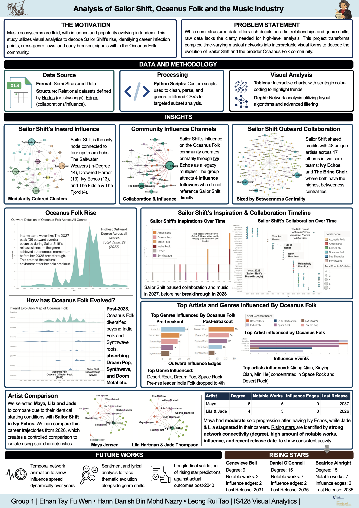

```{=html}
<div class="poster-container">
  <a href="images/poster.pdf" target="_blank" class="poster-download-link" title="Open full PDF">
    <svg viewBox="0 0 24 24" fill="none" stroke="currentColor" stroke-width="2" stroke-linecap="round" stroke-linejoin="round" width="18" height="18"><path d="M21 15v4a2 2 0 01-2 2H5a2 2 0 01-2-2v-4"/><polyline points="7 10 12 15 17 10"/><line x1="12" y1="15" x2="12" y2="3"/></svg>
    <span>Download PDF</span>
  </a>
  
</div>
```
